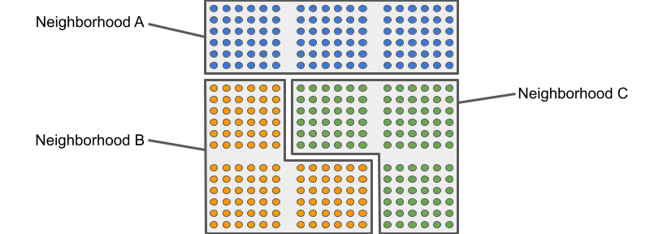
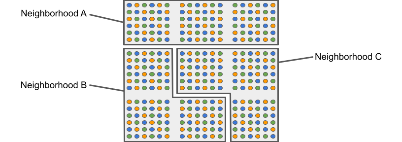
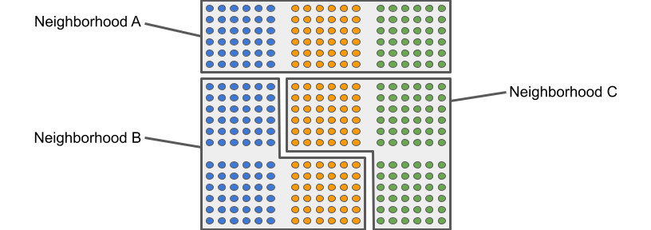
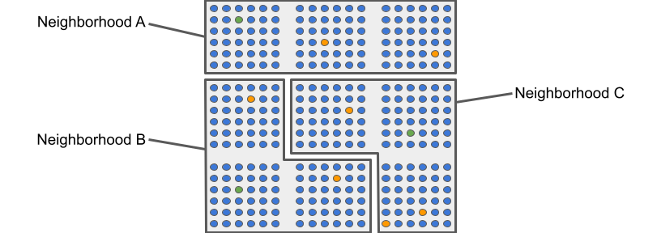
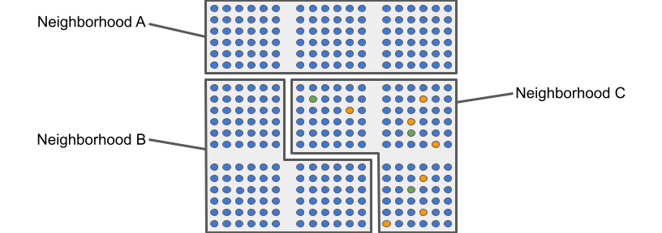

``divintseg``
=============

``divintseg`` is a simple package for computing diversity,
integration, and segregation metrics on data sets.
It is typically used with demographic data such as
census data.

For details on how ``divintseg`` defines diversity,
integration, and segregation, including detailed
examples, please see the `README.md`_ file in the
`divintseg repository`_.

.. _README.md: https://github.com/vengroff/divintseg/blob/main/README.md

.. _divintseg repository: https://github.com/vengroff/divintseg

Installing ``divintseg``
------------------------

Installation follows the typical model for Python::

    pip install divintseg

will install the package in your python environment.

If you are using a tool like `conda <https://docs.conda.io/en/latest/>`_
or `poetry <https://python-poetry.org/>`_ to manage
your dependencies, then you can add ``divitseg`` the
same way you would add any other dependency.

A Motivating Example
--------------------

Consider a set of communities, *W*, *X*, and *Y*. Each has three
demographic groups, whose members are represented below by blue, orange
and green dots.

Community W
"""""""""""

Community X
"""""""""""

Community Y
"""""""""""

Intuitively, *W* is diverse, because it has equal numbers
of all three groups, but not at all integrated, because each
of the groups live in entirely different neighborhoods.
*X*, on the other hand, is not only diverse, but integrated.
There are equal numbers of all three groups and they are
equally distributed among the three neighborhoods. What about
*Y*? It is also diverse like *W* and *X*. It looks more
integrated than *W*, but less integrated than *X*.

What happens if we ask ``divinseg``? Here's some code::

    import pandas as pd

    from divintseg import di

    df = pd.DataFrame(
        [
            ['W', 'A', 108, 0, 0],
            ['W', 'B', 0, 108, 0],
            ['W', 'C', 0, 0, 108],

            ['X', 'A', 36, 36, 36],
            ['X', 'B', 36, 36, 36],
            ['X', 'C', 36, 36, 36],

            ['Y', 'A', 36, 36, 36],
            ['Y', 'B', 72, 0, 36],
            ['Y', 'C', 0, 72, 36],
        ],
        columns=['community', 'neighborhood', 'blue', 'green', 'orange'],
    )

    df_di = di(df, by='community', over='neighborhood')

The resulting ``df_di`` is as follows::

               diversity  integration
    community
    W           0.666667     0.000000
    X           0.666667     0.666667
    Y           0.666667     0.518519

As we expected, the overall diversity of the three
communities is the same, ``0.666667``. The integration
of *W* is ``0.000000``, which means there is no
integration at all. That also ties out with what we
expected.

What about *X*'s integration. It is ``0.666667``,
the same as its diversity was. When using ``divintseg``'s
chosen methodology, diversity sets an uppor bound
on integration. So *X*'s integration is as high as it can
possibly be give that its diversity is ``0.666667``.

And finally, *Y*. It also has diversity ``0.666667`` like the
other two. But its integration is ``0.518519``. Unlike *X*,
it did not acheive it's maximum integration potential given
its diversity. That also ties out with what we expect
based on a visual examination of the two.

We haven't gone into any of the math behind how these numbers
are computed, but we have at least shown that they are producing
results that make intuitive sense for the three cases above.
The math behind all of this is explained in the
the `README.md`_ file in the
`divintseg repository`_.

A Second, Less Diverse Example
------------------------------

All of the communities we looked at in the previous section were
quite diverse, though their level of integration clearly differed.
What about some less diverse communities? Consider *Z* and *Q* as
shown here.

Community Z
"""""""""""

Community Q
"""""""""""

Neither of these is diverse. The size of the green and orange groups in both
are small at 3 and 7 respectively. But *Z*, where the small green and orange
groups are spread out among the neighborhoods, looks like it is at least
be more integrated (and thus less segregated) than *Q*, where all of the
orange and green groups are in Neighborhood C. Let's run the numbers and
find out::

    df = pd.DataFrame(
        [
            ['Z', 'A', 105, 1, 2],
            ['Z', 'B', 105, 1, 2],
            ['Z', 'C', 104, 1, 3],

            ['Q', 'A', 108, 0, 0],
            ['Q', 'B', 108, 0, 0],
            ['Q', 'C', 98, 3, 7],

        ],
        columns=['community', 'neighborhood', 'blue', 'green', 'orange'],
    )

    df_di = di(df, by='community', over='neighborhood', add_segregation=True)

The result is::

               diversity  integration  segregation
    community
    Q           0.060223     0.057213     0.942787
    Z           0.060223     0.060185     0.939815

This time, we added the ``add_segregation=True`` flag, which gave
us a third column in the result.

As expected, the diversity numbers for *Q* and *Z* are a lot lower
than they were for *X*, *Y*, and *Z*. They are also the same, because
the total size of each of the three groups in the community is the
same in *Q* and *Z*. But, as expected, *Q* is more segregated. It is
also less integrated.

As was the case before with *W*, *X*, and *Y*, neither *Z* nor *Q* has an
integration number greater than its diversity number. Even though in *Z* the
minority groups are spread out, the community as a whole has a low
integration score of ``0.060185``. The maximum it could possibly
achieve is it's diversity score, which is ``0.060223``. So even though the
minority groups are spread out, the fact that *Z* is not diverse means
it has no chance of acheiving the kind of integration scores that *X* and
*Y* did.

Again, the details of the computation are explained in the
the `README.md`_ file in the
`divintseg repository`_.

.. toctree::
   :maxdepth: 1
   :hidden:

   self
   api.rst

Indices and Tables
==================

* :ref:`genindex`
* :ref:`modindex`
* :ref:`search`
